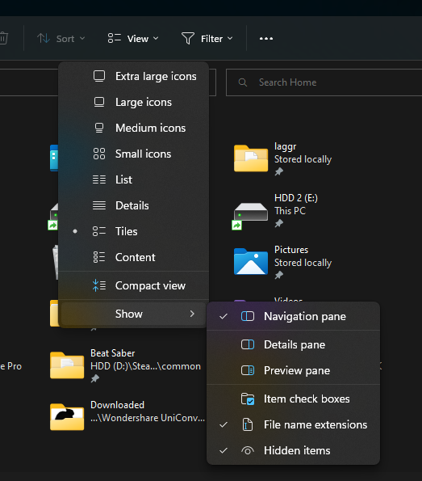
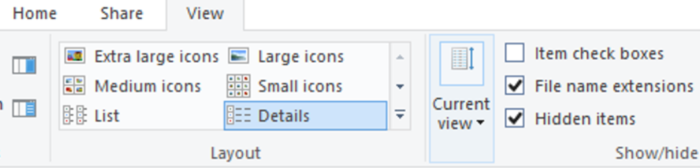

# Migrating to a git install

A lot of you may have installed MyCountryBalls by downloading the source code in a zip file, which doesn't support updating. This tutorial will explain how to migrate to a git-based install while keeping your data.

## 1. Install requirements
---
Obviously, you now need to install [git](https://git-scm.com/downloads) on your computer.

During the installation, be sure to choose the option that says "Git from the command line and also for 3rd-party software". Leave the other options to their default values.

## 2. Download the bot from git
---
Windows
Right-click in the place where you want to install the bot, for instance your desktop, and select "Git bash here".

Paste the following command:
```bash
git clone https://github.com/try-econome/MyCountryBalls.git
```
A folder named `MyCountryBalls` should have appeared. If not, right-click and hit "Refresh".

macOS/Linux
Open the terminal app and navigate to the folder where you want to install the bot using the `cd` command. For instance, if you want to install the bot in your desktop, type `cd Desktop`.

Paste the following command:
```bash
git clone https://github.com/try-econome/MyCountryBalls.git
```
A folder named `MyCountryBalls` should have appeared.

## 3. Enable hidden files
---
We will need to move all files present in the folder that was just downloaded. The operating system is hiding some files by default, so we will have to turn an option on to ensure we can see everything.

### Windows
---
1. Open the file explorer
2. Click on the View tab
        - Windows 11: In the dropdown, select "Show" then click "Hidden items". You can also turn on "File name extensions", may be useful later. 



        - Windows 10: Tick the "Hidden items" checkbox. You can also tick "File name extensions", may be useful later. 



### macOS
---
In theory, `Cmd+Shift+. (dot)` works, but it doesn't for me, maybe because of the keyboard layout. If it doesn't work for you, here's an alternative way to show hidden files:

1. Open the terminal
2. Type the following command
```bash
defaults write com.apple.Finder AppleShowAllFiles true
```
3. Open the Force Quit dialog (Apple Menu > Force Quit or Alt+Cmd+Esc) and force restart the Finder

### Linux
---
It depends on the file explorer application you're using. Dig the option, or use the terminal with `ls -a`. Or just use the `mv` command during the next step, which takes everything.

## 4. Move the files
---
1. Open the new folder downloaded from git. It should be named `MyCountryBalls`.
2. Open in a different window or tab the old bot folder, the one you're currently using. It may be named `MyCountryBalls-master` or something like that.
3. Select everything in the new folder (Ctrl+A) and move the files to the **old** folder.
4. You will see warnings about conflicting files. Tick the option to replace all files.
5. The new folder should now be empty. **Check that the old folder now has a `.git` hidden folder!**
6. Congratulations, your configuration is now migrated. Run `git status` to ensure the status of git, see if any problem is listed.

You can now continue by updating and restarting the bot.

Econome Was Here :)